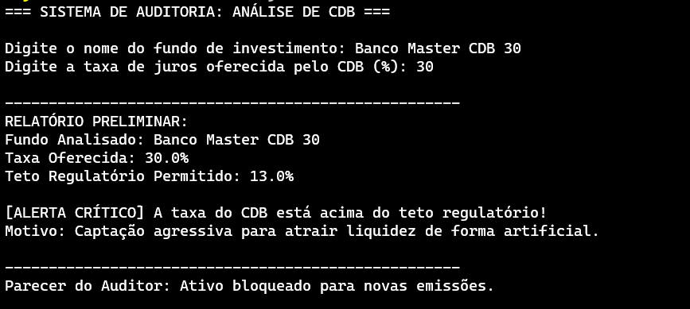

# 🏦 Laboratório Prático: Validação de Risco de CDB (Banco Master)

## 📌 Contexto da Atividade
Os órgãos de regulamentação financeira e as auditorias internas precisam monitorar constantemente as taxas de juros oferecidas por instituições financeiras em **Certificados de Depósito Bancário (CDBs)**. Taxas excessivamente altas em relação ao teto regulatório do mercado costumam indicar captações agressivas de liquidez para cobrir problemas de caixa, exigindo intervenção imediata.

Neste laboratório, você aplicará os fundamentos de **lógica de programação**, utilizando **variáveis comuns** e **estruturas condicionais compostas** (`if / else` ou `se / senao`) para automatizar o parecer de risco de um fundo de investimento.

---

## 🎯 Objetivo
Escrever um programa interativo que receba o nome de um fundo de investimento e a taxa de juros oferecida por seu CDB, compare esses dados com o limite prudencial do mercado e emita um laudo de auditoria automatizado.

---

## ⚙️ Regras de Negócio e Requisitos

O seu programa deve seguir rigorosamente as seguintes especificações:

1. **Declaração de Variáveis:**
   * O programa deve conter variáveis para armazenar:
     * O **nome do fundo** analisado (Tipo texto/Cadeia/String).
     * A **taxa de juros** oferecida pelo CDB em porcentagem (Tipo real/Double).
     * O **teto regulatório** permitido, fixado em `13.0` (Tipo real/Double).
     * Um indicador de **risco** (Tipo lógico/Boolean), inicializado como falso.

2. **Entrada de Dados Interativa:**
   * O sistema deve solicitar que o usuário digite via teclado o nome do fundo e a taxa de juros do CDB.

3. **Processamento e Validação (`If / Else`):**
   * O algoritmo deve exibir um relatório preliminar contendo os dados informados.
   * Utilizando uma estrutura condicional:
     * **Se** a taxa do CDB for **maior** que o teto regulatório (`13.0`), o programa deve exibir um `[ALERTA CRÍTICO]` informando captação agressiva e alterar a variável de risco para **verdadeiro (true)**.
     * **Caso contrário (`senao`)**, deve informar que o ativo está `[REGULAR]` e manter a variável de risco como **falso (false)**.

4. **Parecer Final:**
   * Ao final, baseando-se exclusivamente no estado da variável lógica de risco, o programa deve exibir o veredito do auditor:
     * Com risco: `"Parecer do Auditor: Ativo bloqueado para novas emissões."`
     * Sem risco: `"Parecer do Auditor: Ativo liberado para comercialização."`

  

---

## 🚀 Como Entregar
1. Desenvolva o algoritmo na linguagem solicitada pelo professor (**Portuguol Studio** ou **Java**).
2. Teste o programa com pelo menos dois cenários diferentes:
   * **Cenário 1 (Regular):** Fundo com taxa de `11.5%`.
   * **Cenário 2 (Risco):** Fundo com taxa de `15.8%`.
3. Submeta o código-fonte (arquivo `.por` ou `.java`) na plataforma da disciplina conforme o prazo estipulado.

> **💡 Dica do Professor:** Lembre-se de validar se a entrada de dados decimal utiliza ponto (`.`) ou vírgula (`,`) dependendo da ferramenta que você estiver utilizando!
